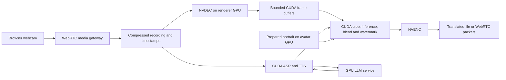

# Eight-GPU optimization and upgrade plan

**Project:** xeon-video-translation  
**Hardware target:** Dell PowerEdge XE7740, eight RTX PRO 6000 Blackwell Server Edition GPUs, 96 GB per GPU  
**Date:** 3 October 2026  
**Status:** implementation in progress. See [implemented updates and qualification](upgrade-implementation.md) for completed local work, test evidence and remaining phases. Hardware performance remains unverified.

## 1. Outcome and priorities

Build a GPU-first implementation of all three modes:

- **Fast translation:** webcam → WebRTC capture → translated, synchronized video within minutes after Stop. Preserve every utterance while trading selected visual refinements for speed.
- **Quality batch:** preserve meaning, voice identity, face detail and temporal consistency. Spend additional compute only when comparisons show a quality benefit.
- **Voice avatar:** microphone + prepared portrait → streamed speech and lip motion, with prompt interruption and predictable latency under batch load.

The first priorities are strict GPU execution, keeping video frames in GPU memory, and protecting interactive capacity. Replacing every model is not the starting point. A component earns its place through quality and end-to-end measurements on this host.

CPU signaling, authentication, SQLite, filesystem operations, demux/mux, small audio buffers and inexpensive VAD remain acceptable. Heavy video inference, supported video codecs, and repeated full-frame image processing belong on GPUs. Record and justify remaining CPU operations. Small operations should migrate only if their measured total cost improves, including transfer overhead.

### Current baseline—do not reimplement completed work

The inspected checkout at `025b01e` before this update includes:

- CUDA batched Faster-Whisper ASR; FP16 NLLB and CUDA TTS backends.
- An OpenAI-compatible LLM client with a vLLM-oriented deployment default.
- FP16 MuseTalk defaults, CUDA fast-math settings, batched model operations and process-per-GPU LatentSync workers.
- NVENC window encoding and final output encoding, with software fallback still present.
- Bounded windows, checkpoints, durable jobs, ownership, revisions and cancellation that drains native calls.

At that baseline, gaps included CPU renderer fallback, CPU frame processing/transfers, software WebRTC codecs, avatar NumPy/WAV exchange, readiness and allocation checks. Several are addressed in the implementation report; the phase checklists below retain the broader acceptance requirements.

Historical logs contain a 52-second clip at 120.60 seconds total with MuseTalk (95.858 seconds lipsync), and 271.18 seconds total with four-GPU LatentSync (247.163 seconds lipsync). These are individual historical runs, not current p95 results. The bring-up fixture includes looped video and synthesized narration; it must not stand in for real webcam quality tests. Rebaseline the current source before comparing upgrades. Source: `artifacts/bench/xe7740-2026-10-03.jsonl` and `docs/gpu/bring-up-2026-10.md`.

## 2. GPU allocation

Use GPU UUIDs in deployment configuration. The indices below describe roles and must be mapped after checking topology, availability and NUMA placement. Eight 96 GB cards are separate memory domains; do not treat their aggregate memory as one pool or assume NVLink/fast peer access.

### Recommended dedicated-host profile

| GPU | Primary role | Capacity policy |
| --- | --- | --- |
| 0 | Translation speech: ASR, TTS, optional NLLB | Resident models; bounded stage batches; no avatar work here |
| 1 | LLM serving for translation, rewrites and avatar dialogue | Bounded context, generation length, KV cache and concurrency; reserve interactive admission |
| 2 | Fast MuseTalk and its decode/composite/encode path | Warm renderer; independent fast queue |
| 3 | Avatar ASR and streaming TTS | Reserved for interactive sessions |
| 4 | Avatar portrait renderer and hardware video output | Reserved; persistent portrait state and bounded frame queue |
| 5–7 | LatentSync batch pool | One process per leased GPU; compare one, two and three workers |

Optional alignment, diarization and separation acquire an exclusive lease on GPU 7 before the batch renderer uses that card. Do not run an unconstrained audio-quality model beside a renderer simply because VRAM is available. GPU 7 returns to the renderer pool after the audio-quality worker drains and releases its allocation. Begin with static per-job assignments; dynamic borrowing comes later.

Start with the configured Qwen model as the LLM baseline. Prove weights, KV cache and workspaces fit GPU 1 with headroom. Protect avatar requests through bounded background admission and short translation requests. If the shared LLM cannot meet avatar latency targets, evaluate a separate small interactive replica or an additional reserved GPU, reducing batch width accordingly. Priority queues cannot instantly preempt a running kernel or long prefill.

### Shared-host profile

The bring-up notes report existing vLLM workloads on GPUs 1 and 2. If that is still true:

| GPU | Assignment |
| --- | --- |
| 0 | Translation speech |
| 1–2 | Existing externally managed LLM workloads; reuse only an approved endpoint/capacity allocation |
| 3 | Fast MuseTalk |
| 4 and 7 | Two-worker LatentSync pool; GPU 7 also leases optional audio-quality work between stages |
| 5 | Avatar speech |
| 6 | Avatar rendering/media |

Do not stop or resize unrelated vLLM containers. Mark LLM performance and availability as an external dependency in this profile. An explicitly selected NLLB translation mode can operate independently; avatar conversation still requires an available LLM endpoint.

### Batch-only profile

When interactive sessions are deliberately disabled and all eight cards are assigned to this project: GPU 0 handles speech, GPU 1 handles the LLM, and GPUs 2–7 form a six-worker batch pool. Compare whole-job replicas with within-job sharding. Do not assume six workers provide sixfold speedup. Never evict an active interactive session automatically to enter this profile.

## 3. Target media architecture

For translation capture, preserve negotiated compressed video packets where possible, then decode once for processing. For the avatar, keep the prepared portrait and generated frames on the renderer GPU through encoding. Audio and video use a shared timestamp contract.

**Selected implementation direction:** PyNvVideoCodec for offline decode/encode adapters; CUDA PyTorch operations initially for transforms and blending, with CV-CUDA evaluated where it materially helps. PyNvVideoCodec supports NVDEC/NVENC and DLPack exchange with PyTorch. This supports the intended architecture, but does not prove that our integrated pipeline has no copies. [NVIDIA API guide](https://docs.nvidia.com/video-technologies/pynvvideocodec/pynvc-api-prog-guide/using_pynvvideocodec_apis.html), [CV-CUDA documentation](https://cvcuda.github.io/CV-CUDA/).

For WebRTC, prototype a GStreamer media worker while preserving the application’s authentication, session and signaling APIs. `webrtcbin` handles the peer/media connection and `nvh264enc` accepts CUDA-memory frames. Verify the complete bridge, buffer ownership and browser negotiation before replacing aiortc in production. PyNvVideoCodec alone is not a WebRTC stack. [GStreamer WebRTC](https://gstreamer.freedesktop.org/documentation/webrtc/index.html), [NVIDIA H.264 encoder plugin](https://gstreamer.freedesktop.org/documentation/nvcodec/nvh264enc.html).

## 4. Phased implementation backlog

Every item below is unfinished unless already identified in the baseline. The configuration names and new modules described here are proposed interfaces.

### P0 — Make GPU execution verifiable and mandatory

**Priority:** first. **Dependencies:** none.

- [ ] Add a GPU deployment policy requiring CUDA model placement and hardware video encoding. Keep a separately selected CPU development profile.
- [ ] Replace automatic renderer CPU fallback and automatic software video encoding with actionable errors in the GPU profile. An explicit diagnostic override must report degraded execution and cannot pass performance acceptance.
- [ ] Add startup smoke inference for each loaded model, ONNX session/provider verification, and a real short codec decode/encode test. Package presence and `nvidia-smi` alone are insufficient.
- [ ] Record actual GPU UUID, compute capability, dtype, provider assignment, model revision, codec and image digest in readiness and benchmark metadata. Identify large ONNX operators assigned to CPU; do not confuse small shape/control operations with CPU model inference.
- [ ] Inventory PCIe/NUMA topology, peer-copy support, CPU/RAM/NVMe capacity, codec capabilities, occupied devices and memory headroom.
- [ ] Pin a compatible CUDA/PyTorch/ONNX Runtime/video-codec stack and lock each service’s dependencies independently. Remove inaccurate hardware-readiness and CPU/GPU status text from documentation.

**Files:** `backend/app/config.py`, `backend/app/api/diagnostics.py`, both renderer device resolvers and health endpoints, `scripts/gpu_acceptance.py`, GPU Dockerfiles and Compose overlays.

**Local proof:** missing-CUDA/provider/codec failure tests; explicit CPU profile tests; safe capability-report schema; dependency and image-build checks where possible.  
**GPU gate:** an actual kernel and codec operation succeeds on every assigned service/device; no unexpected heavy CPU fallback.

### P1 — Instrument the full pipeline and establish the baseline

**Dependencies:** P0 reporting contract. Build before optimizing.

- [ ] Add tracing around queueing, decode, transfers, face detection, crop, VAE, denoise, blending, encode, ASR, LLM and TTS.
- [ ] Measure CPU wall time and GPU time separately using CUDA events correctly around asynchronous work. Add sampled Nsight Systems captures for representative requests.
- [ ] Collect per-process VRAM, host RSS, pinned memory, NVENC/NVDEC activity, PCIe traffic, storage throughput and decoder/encoder queue depth.
- [ ] Record LLM prefill/first-token/token-stream latency and avatar endpoint-to-first-audio, first-video, interruption, late frames and A/V skew.
- [ ] Benchmark cold start and warm operation separately. Use fixed inputs, seeds/configuration where supported, and record output hashes plus quality judgments.

**Files:** existing operations/metrics endpoints, renderer progress callbacks, `scripts/benchmark_modes.py`, `scripts/compare_benchmarks.py`, evaluation fixtures; add a device/transfer trace schema.

**Local proof:** trace propagation, timestamps, aggregation and benchmark comparisons.  
**GPU gate:** capture the current baseline under isolated and simultaneous load. Optimize the measured dominant stages first.

### P2 — Remove repeated video transcoding and CPU codec fallback

**Dependencies:** P0–P1. First media improvement.

- [ ] Retain current NVENC window support but remove process-wide silent fallback in the GPU profile. Report failures per request/device and recover only after a successful hardware probe.
- [ ] Add decoder/encoder adapters and a shared frame contract: presentation timestamp, time base, pixel format, color range/matrix, dimensions, device, owner and completion event.
- [ ] Decode the original stream sequentially into bounded windows with context. Pass frame ranges to the renderer instead of repeatedly writing, reopening and decoding intermediate MP4 files.
- [ ] Encode each accepted output frame once. Keep resumable encoded parts or explicit checkpoints; preserve exact frame ordering and audio duration across resume.
- [ ] Preserve VFR timing, rotation, portrait dimensions, end-of-stream flushing and audio/video offsets. Explicitly negotiate or reject unsupported codec/HDR formats in the GPU profile.
- [ ] Use lossless or demonstrably quality-preserving temporary representations where an intermediate is unavoidable. NVENC CQ and x264 CRF values are not interchangeable quality guarantees.

**Files:** `backend/app/pipeline/windowed.py`, renderer clients and contracts, MuseTalk video reader/writer, LatentSync video utilities, mux/watermark code; proposed shared media adapters with pinned versions across service images.

**Local proof:** frame/timestamp contracts, adapters with fake buffers, seek/flush, resume/corruption and error handling using real CPU media fixtures.  
**GPU gate:** hardware codecs actually execute, frame counts/timestamps remain correct, and repeated lossy window transcodes disappear from the hot path.

### P3 — Keep image processing and render data on the GPU

**Dependencies:** P2 frame contract; implement MuseTalk first, then LatentSync.

- [ ] Replace full-frame NumPy/OpenCV crop, resize, mask blending and supported affine transforms with batched CUDA operations.
- [ ] Connect decoder surfaces, tensors, model outputs and encoder surfaces with explicit ownership and CUDA stream/event synchronization.
- [ ] Cache static masks, portrait latents and invariant model inputs. Warm bounded shape/batch buckets instead of triggering new allocations and compilation for every window.
- [ ] Blend the watermark on GPU, then encode, avoiding a CPU `drawtext` round trip. Preserve disclosure in every output path.
- [ ] Remove repeated `.cpu().numpy()` conversions from high-volume image paths. Small landmarks/control metadata may cross to CPU when that is cheaper.
- [ ] Budget decode surfaces, in-flight tensors, workspace, model weights, frame queues and pinned memory separately. Leave initial 15–20% VRAM headroom, adjusted from measured peaks.
- [ ] Prefer same-process tensor handoff on one GPU. DLPack does not provide automatic cross-process or cross-GPU sharing. Evaluate CUDA IPC/peer copies only where ownership, topology and lifetime are proven; otherwise use bounded, measured transfers.

**Local proof:** geometry, mask and color reference tests; queue/lifetime tests; synthetic visual comparisons. CPU reference implementations remain test oracles.  
**GPU gate:** trace shows no unnecessary full-frame host round trips; numerical/image differences meet tolerances and blind review finds no new seams, identity changes or color shifts.

### P4 — Replace the WebRTC media hot path

**Dependencies:** P2–P3 interfaces; prototype can begin earlier.

- [ ] Prototype GStreamer receive/record and avatar-send workers with GPU codecs. Retain current API and browser workflows during migration.
- [ ] Prefer browser-compatible H.264 negotiation initially; implement RTP timestamps, keyframe requests, RTCP feedback, congestion behavior and audio synchronization.
- [ ] Record compressed incoming video without an unnecessary decode/encode cycle when container/codec negotiation permits it. Route required conversion through hardware codecs.
- [ ] Replace avatar `.npy` frame files and per-chunk WAV exchange with bounded frame/audio queues; keep durable files only for explicit debugging and job checkpoints.
- [ ] Keep prepared portraits and compositor state resident. Use small, measured chunks and a bounded playout buffer; never queue seconds of stale video.
- [ ] Carry a generation identifier through model work, encoding, transport and playback. On interruption, discard stale queued media and request a clean keyframe/decoder transition as needed.
- [ ] Preserve HTTPS, authentication, TURN, ownership, cleanup, captions and heard-sentence acknowledgments.
- [ ] Allow explicit static-portrait/audio continuation on rendering failure; record it as degraded avatar output. Do not substitute CPU rendering silently.

**Files:** `services/ingest-webrtc/app/main.py`, `avatar.py`, `playback.py`, MuseTalk avatar service, proposed media worker/image, frontend connection handling.

**Local proof:** transport contract tests, simulated worker failures, bounded queues, browser codec negotiation, interruption fencing and real CPU loopback WebRTC tests.  
**GPU gate:** hardware encode/decode with Chrome, Firefox and Safari on local and TURN-relayed connections; continuous A/V sync and interruption tests under batch load.

### P5 — Tune speech, LLM serving and audio quality by mode

**Dependencies:** P0–P1; independent of most video migration.

- [ ] Retain Faster-Whisper/CTranslate2 CUDA as the ASR baseline. Sweep batch size and model choice for fast, quality and avatar modes independently; preserve word coverage and timestamps. Its upstream implementation already supports CUDA and batched inference. [Faster-Whisper](https://github.com/SYSTRAN/faster-whisper).
- [ ] Keep large-v3 as the quality reference; evaluate smaller/turbo variants for interactive use through WER/CER, language and short-word tests. Do not apply batch waiting delays to an interactive utterance.
- [ ] Separate LLM interactive admission from long translation work. Bound prompts, output length, active sequences and KV cache; avoid uncontrolled memory reservations or CPU weight offload. Tune the actual server using its documented memory/concurrency controls. [vLLM tuning](https://docs.vllm.ai/en/latest/configuration/optimization/).
- [ ] Compare the configured LLM against NLLB and at most two stronger candidates on the same translation set. Preserve numbers, names, register and glossary terms; a larger LLM is not automatically more faithful.
- [ ] Warm selected TTS models and cache voice/reference conditioning by model revision, language and speaker. Batch compatible offline segments; prioritize streaming audio for avatars.
- [ ] Measure TTS validation and retry cost. Reuse verified cache results with versioned validation metadata. Keep complete-text safeguards, bounded resynthesis and meaning checks for rewrites.
- [ ] Keep WhisperX alignment, diarization and Demucs on an exclusively leased GPU when enabled. Use only the features needed by that job. Keep small DSP/VAD operations on CPU unless measurements justify migration.
- [ ] Publish a language/voice quality matrix and explicit unsupported combinations. Evaluate model changes on pronunciation, omitted words, identity, timing and streaming continuity.

**Local proof:** language routing, batching isolation, cache invalidation, rewrite/content checks and bounded server errors.  
**GPU gate:** model quality comparisons and latency by language/voice under concurrent traffic; no hidden CPU offload or GPU memory contention.

### P6 — Optimize model execution and multi-GPU batch throughput

**Dependencies:** P1–P3 baseline and correctness gates.

- [ ] Benchmark current FP16 against FP32 references; evaluate BF16 only where supported and quality-tested. Make TF32/determinism settings part of benchmark provenance.
- [ ] Test `torch.compile` on fixed-shape MuseTalk/LatentSync submodules. Measure cold compilation, warm latency, graph breaks and memory.
- [ ] Prototype ONNX/TensorRT for a bounded, compatible module only after profiling identifies worthwhile overhead. Keep a validated CUDA PyTorch implementation available if the optimized GPU backend fails.
- [ ] Check exact SM120 and operator support for each engine/runtime version. Do not assume B200/SM100 results apply to RTX PRO/SM120. FP8/FP4 are separate quality experiments, not deployment defaults. [TensorRT support matrix](https://docs.nvidia.com/deeplearning/tensorrt/latest/getting-started/support-matrix.html).
- [ ] Sweep batch sizes and overlap decode, inference and encode with bounded queues. Tune compute and codec occupancy together.
- [ ] Measure LatentSync at 1/2/3 GPUs in the mixed profile and up to 6 in batch-only mode. Compare sharding one job with processing independent jobs on replicas. Report turnaround and source-minutes/hour separately.
- [ ] Preserve temporal context, deterministic output ordering, seeds and checkpoint ownership across workers. Change pool membership only after in-flight windows drain.
- [ ] Evaluate restoration only where blind comparisons show improvement. Preserve facial hair/identity; never assume CodeFormer improves every frame. Benchmark stronger lip/portrait models as a separate experiment if current model quality remains limiting.

**Local proof:** worker ordering, failure/drain, cache signatures, backend selection and output-schema tests.  
**GPU gate:** promote an optimization only with measured end-to-end benefit and no unacceptable quality loss; record unsuccessful experiments too.

### P7 — Coordinate all eight GPUs and host resources

**Dependencies:** P0 telemetry; integrate throughout P2–P6.

- [ ] Keep one durable dispatcher and SQLite job ownership for this single host. Add per-stage GPU leases and explicit model-worker capacity; a Redis/Kubernetes migration is not a prerequisite.
- [ ] Reserve the avatar GPUs. Schedule fast work ahead of batch work, with aging to prevent starvation. Bound each nonpreemptive work unit.
- [ ] Track GPU compute, VRAM, codec sessions, host RAM, pinned memory, disk space and active streams in admission decisions. A GPU with free VRAM can still be compute-saturated.
- [ ] Implement dedicated, shared-host and batch-only deployment profiles. Reassign devices only after draining workers and releasing memory; do not rely on transparent CPU offload.
- [ ] Place processes and host buffers near their GPU’s NUMA node where measured beneficial. Tune CPU thread counts against cgroup quotas.
- [ ] Use fast local storage for durable artifacts/model caches, bounded scratch space, atomic outputs, reservations and cleanup. Avoid storing raw frame files on every avatar turn.
- [ ] Add backpressure from browser/encoder queues to render scheduling and graceful job/session limits with useful queue estimates.

**Local proof:** exclusive leasing, external-GPU exclusion, starvation protection, reservations, restart recovery and cancellation at every boundary.  
**GPU gate:** simultaneous avatar + fast + batch work meets the interactive targets without OOM, unbounded queues or accidental device overlap.

### P8 — Qualify the release on the actual host

**Dependencies:** all selected production paths from P0–P7.

- [ ] Build every CUDA image and verify exact pinned dependency/model manifests on the target driver.
- [ ] Run the existing backend, media, ingest and browser suites; add the new hardware tests without replacing CPU correctness tests.
- [ ] Use real recordings covering 10/30/52/120 seconds, portrait/landscape, 720p/1080p, VFR/30/60 fps, motion, facial hair, glasses, low light, noise and language/speaker diversity. Treat 4K as an explicit stress/capacity experiment before advertising it.
- [ ] Run isolation, mixed-load, overload, restart, codec-failure, worker-crash, disk-pressure and external TURN tests.
- [ ] Run at least 30 warm samples per key latency scenario for initial p95 estimates; report sample size and distributions. Use a 30-minute avatar session and an eight-hour mixed-load soak.
- [ ] Publish the device map, exact tested concurrency, quality scorecards, latency/throughput, peak resources, source/image/model hashes and known limits.
- [ ] Roll out one mode at a time, retain a validated GPU release for rollback, and back up the durable state before schema changes. Performance acceptance cannot pass through a software-codec fallback.

## 5. Acceptance targets

These are proposed gates, not achieved results. Initial mixed load is **one avatar session + one fast job + one batch job**, with additional requests queued. Increase advertised concurrency only after the full matrix passes.

| Area | Initial acceptance gate |
| --- | --- |
| GPU policy | All required model/codec operations execute on their assigned devices; unexpected CPU execution is visible and fails qualification |
| Fast translation | Warm p95 ≤180 seconds from Stop to playable result for 30-second 1080p input; ≤180 seconds for the 52-second reference is a stretch target |
| Quality batch | Zero omitted required speech; blinded median ≥4/5 for meaning, voice identity, lip sync and temporal consistency, with critical failures reviewed individually; no hard turnaround cap |
| Avatar response | Warm p95 ≤3 seconds from end of user speech to first audible reply; separately report VAD endpoint delay, LLM, TTS and network contribution |
| Avatar interruption | p95 ≤300 ms from detected interruption to stopped stale audio/video at the client |
| Avatar media | Sustained negotiated 25 fps, bounded queues and ≤80 ms A/V skew at p95; separately measure first moving frame and dropped/late frames |
| Concurrent load | Same interactive gates during the initial mixed load; report queue-inclusive and service-only translation latency separately |
| Stability | No OOM, worker leaks, growing media backlog or stale reply playback in the soak; completed checkpoints survive graceful restart |
| Quality preservation | No new omitted words, timing drift, color/range errors, visible window seams or identity changes from media/precision upgrades |

A universal utilization percentage is not a success metric: reserved interactive GPUs can be idle between turns. The measurements that matter are useful throughput, latency, quality and predictable resource use.

## 6. Work before GPU access returns

### Implement and test locally

- P0 policy/configuration and failure contracts; capability inventory/reporting tools.
- P1 tracing/benchmark schemas and aggregation.
- P2 frame/timestamp interfaces, bounded queues, checkpoints and CPU reference media tests.
- P3 transform reference fixtures and adapter interfaces.
- P4 GStreamer gateway/session contracts, browser fixtures and cancellation handling.
- P5 model routing, server limits, cache/versioning and evaluation harnesses.
- P7 leases, admission, profile generation, device exclusions and recovery tests.
- Docker dependency locks, compatibility checks, documentation and CUDA test discovery.

### Requires target GPUs before completion can be claimed

Actual NVDEC/NVENC behavior, DLPack/IPC lifetime correctness, CUDA transforms, engine builds, SM120 kernels, precision parity, multi-GPU scaling, NUMA/PCIe behavior, model quality, native browser codec transport and latency/concurrency qualification.

CPU mocks establish contracts; they do not establish GPU performance or correct device-buffer synchronization.

## 7. Delivery order and completion evidence

| Order | Deliverable | Required completion evidence |
| --- | --- | --- |
| 1 | Strict GPU policy + profiling (P0–P1) | Actual placement reports and reproducible baseline |
| 2 | Bounded decode/render/encode path (P2–P3) | Correct media plus measured reductions in copies/transcodes |
| 3 | Hardware WebRTC/avatar transport (P4) | Real browser/relay tests with interruption and A/V timing |
| 4 | Speech/LLM improvements (P5; can be developed alongside media) | Per-language quality and latency comparisons |
| 5 | Compilation and multi-GPU tuning (P6) | Reproducible winning configurations for each mode |
| 6 | Capacity integration and release qualification (P7–P8) | Mixed-load/soak scorecard and rollback-ready release |

The first implementation milestone is P0–P1 plus a minimal hardware media adapter. It makes misplaced CPU work impossible to hide and supplies the measurements needed to choose the remaining optimizations.

## References and compatibility checks

- Repository baseline: `docker-compose.gpu.yml`, `docker-compose.avatar.yml`, `backend/app/pipeline/{transcribe,windowed,tts}.py`, renderer implementations, ingest/avatar services and historical benchmark files.
- Check the selected codec package against its [system requirements](https://docs.nvidia.com/video-technologies/pynvvideocodec/read-me/system-requirements-common.html) before pinning it; do not upgrade CUDA/driver packages merely because a newer library exists.
- Pin documentation-referenced library versions only after the CUDA image matrix is resolved and tested. The references above establish capabilities, not performance on this host.
